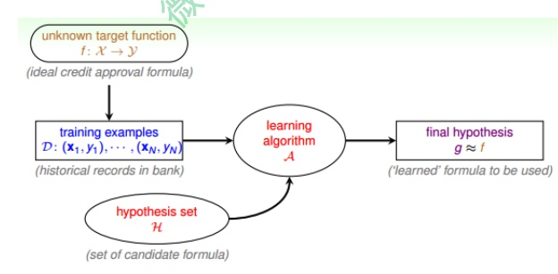

# 1. 机器学习是啥？

## 1.1 啥是机器学习？
前置问题： 什么是“学习”？ 学习就是人类观察、积累经验、掌握某类技能的能力。就像我们学习数学，认识数字，做一些数学的运算；又好比我们学习如何打羽毛球。观察别人怎么打-模仿别人怎么打，这是学习的过程。直接请教练教我们怎么打球，这也是学习的过程。  
机器学习，顾名思义，就是让机器（计算机）也能够像人一样，通过观察大量的数据和训练，发现事物规律，以获得某种分析问题、解决问题的能力。

> 机器学习可以被定义为：Improving some performance measure with experence computed from data. 也就是机器从数据中总结经验，从数据中找出某种规律或者模型，并用它来解决实际问题。

传统的编程，是我们自己定义规则，让计算机根据规则去执行。  
而机器学习，是通过正确的数据，去学习出规则。  

比如说，我们要写一个程序去识别相片里的一棵树。  

传统的方法：我们要定义一棵树，我们有一百条规则，就要想办法把这一百条规则给写下来。  
我们不是通过100条这样的规则，去认识一棵树的。我们是通过观察大量的树，然后就认识树了

去总结出这一百条规则也很难，所以要让机器自己学会怎么去学习出规则（也就是模型！）  

## 1.2 什么情况下能用机器学习？
应用场景大致分为几块：
+ 事物本身存在某种潜在规律（但是不容易辨认出这个规律的时候 ex：视觉上，如何定义一棵树）
+ 某些问题难以使用普通编程（基于规则的）解决。 （规则太多了！！！几百上千条）
+ 有大量的数据样本可供使用

这衣，食，住，行，育，乐这几个领域领域，机器学习已经影响我们很多了。

***机器学习的流程图***

对于理想的目标函数f，我们是不知道的，我们手上拿到的是一些训练样本D，假设是
监督式学习，其中有输入x，也有输出y。机器学习的过程，就是根据先验知识选择模型，该模型对应的hypothesis set（用H表示），H中包含了许多不同的hypothesis，通过演算法A，在训练样本D上进行训练，选择出一个最好的hypothes，对应的函数表达式g就是我们最终要求的。一般情况下，g能最接近目标函数f，这样，机器学习的整个流程就完成了.

# 2. Learning to Answer Yes/No
example:某银行要根据用户的年龄、性别、年收入等情况来判断是否给该用户发信用卡。现在有训练样本D，即之前用户的信息和是否发了信用卡。这是一个典型的机器学习问题，我们要根据D，通过A，在中选择最好的h，得到g，接近目标函数f，也就是根据先验知识建立是否给用户发信用卡的模型。银行用这个模型对以后用户进行判断：发信用卡（+1），不发信用卡（­1）。

H是一大堆模型，h是选择的模型。
## 感知器（Preceptron)

$$\begin{aligned}
h(\mathbf{x}) &=\operatorname{sign}\left(\left(\sum_{i=1}^{d} w_{i} x_{i}\right)-\text { threshold }\right)\\&=\operatorname{sign}(\left(\sum_{i=1}^{d} w_{i} x_{i}\right)+\underbrace{(-\text {threshold })}_{w_{0}} \cdot \underbrace{(+1)}_{x_{0}}) \\
&=\operatorname{sign}\left(\sum_{i=0}^{d} w_{i} x_{i}\right) \\
&=\operatorname{sign}\left(\mathbf{w}^{T} \mathbf{x}\right)
\end{aligned}$$

***preceptrons（感知器）*** = 线性的分类器

> 背景知识  
> 线性可分， 如果存在一个超平面可以讲两集合分开；线性不可分则相反。  
> 感知器学习的目标就是求的能够将训练集正例和负例完全分开的*超平面*  
> 为了找出这样的超平面（则确定感知器模型参数w，b），需要确定一个学习策略（则定义损失（经验）函数并将损失函数极小化）  
> ***损失函数***，一个比较简单的损失函数是被错误分类点的总数，但是这样的损失函数不是参数w，b的连续可导函数（意味着不能求偏导数）

$$感知器（Preceptrons）损失函数： 
L(\omega, b)=\sum_{x_{i} \in M}-y_{i}\left(\omega x_{i}+b\right)
$$

# 3. Learning with Different Output Space
## 有监督学习（有y）
+ Multiclass Classification 多元分类 (ex: coin recognition problem。输出是一个类别)
+ Multilabel Classification 多标签文本分类（ex：一部电影可能有很多标签，爱情、浪漫、动作片。输出是很多个类别）
+ regression （回归问题，输出要是一个实数）
+ Structured Learning(ex：序列标注问题 class of each word)

## 无监督学习（无y）
+ clustring 聚类问题
+ density estimation 密度检测 （ex： 检测有位置坐标的交通事故， 聚类出危险区域）
+ outlier detection（离群点检测）

## 半监督学习（有一些有y）
+ face images with a few labeled(face identifier)
+ medicine data with few label

## 强化学习
> Ex：对你的狗说‘坐下’，它没‘坐下’就惩罚（打他），它坐下了就奖励‘给吃的’

+ 顾客点广告（广告点击奖励） - 强化广告系统
+ 怎么打牌会赢 - 打牌系统

## 3.1 Learning with Different Protocol 
按照不同的协议，机器学习可以分为三种类型：
+ Batch Learning. # batch learning是一种常见的类型。batch learning获得的训练数据D是一批的，即一次性拿到整个D，对其进行学习建模，得到我们最终的机器学习模型。batch learning在实际应用中最为广泛。 （有点像填鸭式学习）
+ Online。 # 在线学习模型，数据是实时更新的，根据数据一个个进来，同步更新我们的算法。 （被动的，序列的）
+ Active Learning。 # 让机器具备主动问问题的能力，例如手写数字识别，机器自己生成一个数字或者对它不确定的手写字主动提问。
active learning优势之一是在获取样本label比较困难的时候，可以节约时间和成本，只对一些重要的label提出需求。

## 3.2 Learning with Different Input Space X
X的类型有哪些？  
+ concrete features。 # 对于机器来说是最容易理解和使用的。
+ raw features # 比如说手写数字识别中每个数字所在图片的mxn维像素值；比如语音信号的频谱等。raw features一般比较抽象，经常需要人或者机器来转换为其对应的concrete features，这个转换的过程就是Feature Transform
+ abstract features。 # 比如某购物网站做购买预测时，提供给参赛者的是抽象加密过的资料编号或者ID，这些特征X完全是抽象的，没有实际的物理含义。所以对于机器学习来说是比较困难的，需要对特征进行更多的转换和提取。

特征工程往往是机器学习的关键！！！能决定模型的上限

# 4. 机器学习的脆弱性
## 4.1 Learning is impossible
No Free Lauch(NFL)说明：无论学习算法多好，或者多坏，它们期望性能都是一样多。 NFL说明了无法保证一个机器学习算法在D以外的数据集上一定能分类或预测正确，除非加上一些假设条件。  
但我们通常理解算法的“性能”，只是针对特定的问题的，特点先验信息的，数据分布。 
> NFL 最重要的寓意，是让我们意识到，脱离具体问题（具体场景），空泛地谈论“什么算法更好”是毫无意义的。 因为若考虑所有潜在问题，所有算法都是一样的。  
> 要讨论算法的好坏，必须要针对具体的学习问题。 在某些问题表现好的算法，可能在另一个问题表现差。学习算法自身的归纳偏好与问题是否相配，往往会起到决定性的作用。

Example：为了快速从A地到达B地，如果A是南京鼓楼，B是南京新街口。那么骑自行车是个很好的方案。；但是这个方案对于A地是南京鼓楼，B是北京新街口，则骑自行车从南京到北京是一件很“难受”的事情。但是我们对这问题并不关心。我们只关心怎么从“南京鼓楼”到“南京新街口”。# 算法只是为了解决某个问题，而不是为了解决所有问题。

## 4.2 Hoeffding不等式
在训练集之外,ML模型是很难做到正确分类. 那么有没有工具能够对未知的目标函数做一些推论,让我们的模型变得有用呢?

> 如果有一个装有很多(数量很大数不过来)橙色球和绿色球的罐子，我们能不能推断 橙色球的比例u?统计学上的做法是，从罐子中随机取出N个球，作为样本，计算这N 个球中橙色球的比例v(抽出的样本)，那么就估计出罐子中橙色球的比例约为u(总体)

$$
\mathbb{P}[|\nu-\mu|>\epsilon] \leq 2 \exp \left(-2 \epsilon^{2} N\right)
$$

意思就是: 当N很大的时候,你抽样的估计值和总体的真实值不会差别很多, 也就是v 和 u 相差不会很大. 我们把结论v=u称为 probably approximately correct(PAC). 
> 如果N足够大, 我们就有很大可能性可以通过样本来推断总体.

统计机器学习最核心的,就是怎么通过样本数据集的一些数字特征,去推断所有数据集上的数字特征. 这也是为什么机器学习能够工作的本质. 引入两个值$E_{in}(h)$  

Hoeffding 不等式推导出机器学习理论可行.

# 5. Training versus Testing
从No free lunch 上看, 各个机器学习模型期望都是一样的,也就是不可行的. 但引入统计知识后,如果样本足够大, 假设有限的话,机器学习一般是可行的. 
> 
机器学习主要的目的: 用训练集尽量来拟合数据,使得模型在没见过的数据中表现要好; 训练集的损失要足够小.